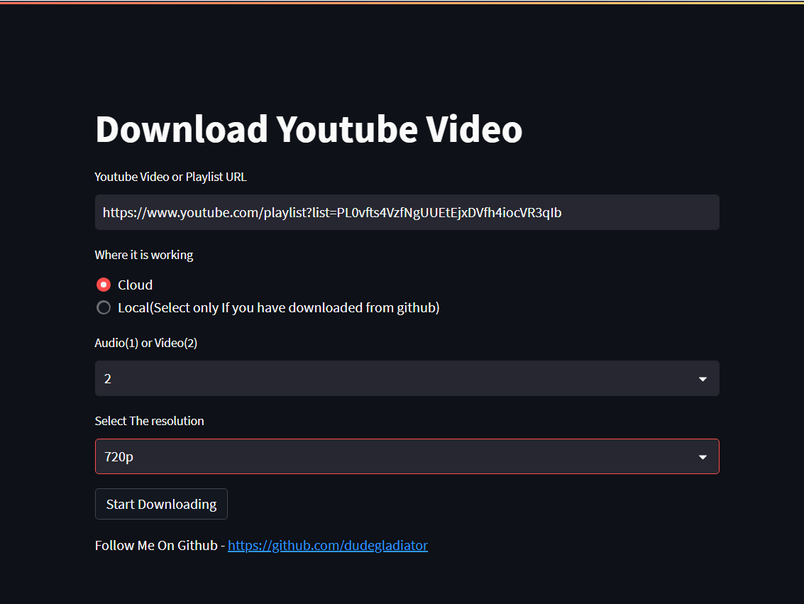

<br/>
<p align="center">
  <a href="https://github.com/dudegladiator/YoutubeDownloader">
    
  </a>

  <h3 align="center">Youtube Video And Music Downloader</h3>

  <p align="center">
    Download copyright-free Youtube video and music in highest quality 
    <br/>
   </p>
   <p align="center">
    <a href="https://youtubedownloader.streamlit.app">Online Version</a>
    <br/>
   </p>
    <br/>
 
</p>

<p align="center">
    App is updated 
    <br/>
   </p>


## About The Project



This can be used to download Youtube Video and Music.


Highest Quality available - 4320p(8K) (Only on Local Server)


Highest  Audio quality available - 128 kbps


Now, You can download Whole Playlist  

## Built With


* [Streamlit](https://streamlit.io/)
* [Pytube](https://pytube.io/en/latest/index.html#)

## Goal

- [x] Add Playlist Downloader
- [x] Make Server Based Model

## Getting Started

To get a local copy up and running follow these simple example steps.

### Installation

1. Run your terminal in administrator
2. Clone the repo

```sh
git clone https://github.com/dudegladiator/YoutubeDownloader
```

3. Install  packages

```sh
pip install streamlit==1.18.1
```
```sh
pip install pytube==12.1.1
```
```sh
pip install pathlib
```
```sh
pip install ffmpeg-python
```

## Usage

To use this here are the steps :

1 . Move to folder Directory

2 . Run this commands
```sh
python -u main.py
```
```sh
streamlit run main.py
```
Click on the link appears in terminal 


