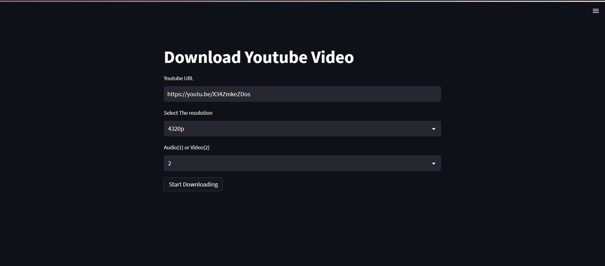

<br/>
<p align="center">
  <a href="https://github.com/dudegladiator/YoutubeDownloader">
    
  </a>

  <h3 align="center">Youtube Video And Music Downloader</h3>

  <p align="center">
    Download any Youtube video and music in highest quality 
    <br/>
    <br/>
  </p>
</p>

    

## About The Project



This can be used to download Youtube Video and Music.
Highest Quality available - 4320p(8K)
Highest  Audio quality available - 128 kbps

## Built With


* [Streamlit](https://streamlit.io/)
* [Pytube](https://pytube.io/en/latest/index.html#)

## Getting Started

To get a local copy up and running follow these simple example steps.

### Installation

1. Run your terminal in administrator
2. Clone the repo

```sh
git clone https://github.com/dudegladiator/YoutubeDownloader
```

3. Install  packages

```sh
pip install streamlit
```
```sh
pip install pytube
```
```sh
pip install pathlib
```
```sh
pip install ffmpeg-python
```

## Usage

To use this here are the steps :
1 . Move to folder Directory
2 . Run this commands
```sh
python -u main.py
```
```sh
streamlit run main.py
```
Click on the link appears in terminal 


